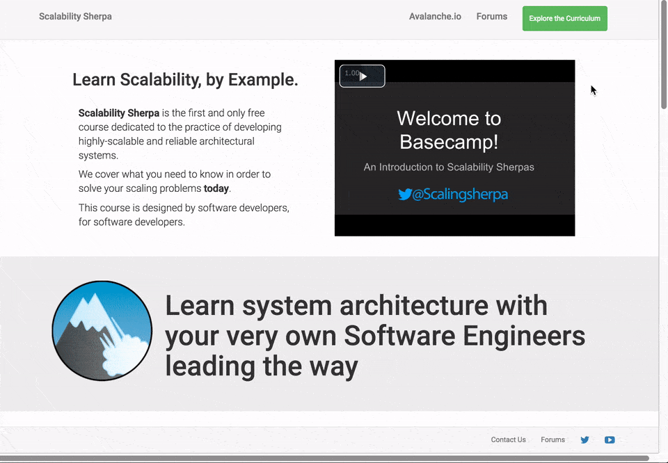
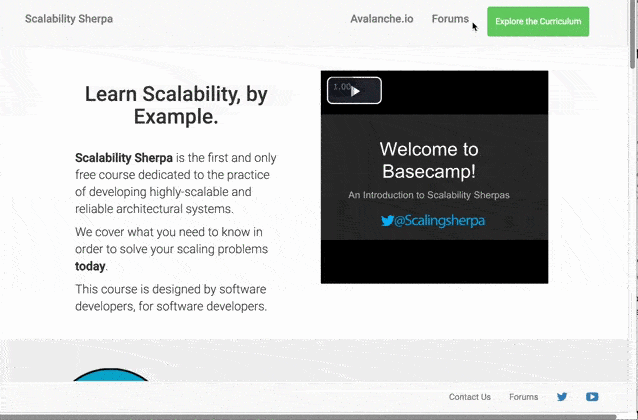
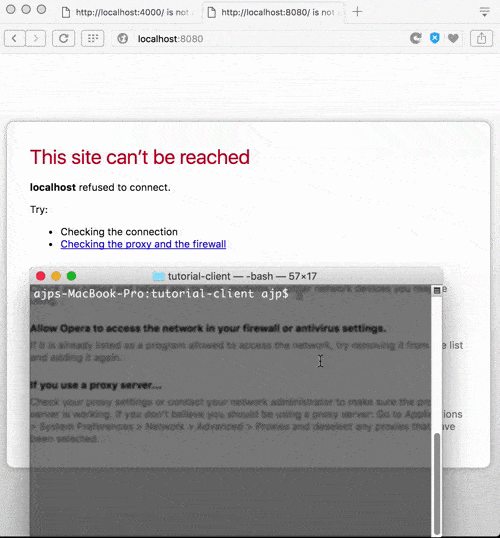

#ScalabilitySherpa.com

**Scalability Sherpa** is the first and only free course dedicated to the practice of developing highly-scalable and reliable architectural systems.
We cover what you need to know in order to solve your scaling problems today.
This course is designed by software developers, for software developers.




##FAQ


####How is the course formatted?

The course is comprised of a series of modules, each with text content, video lessons, and video code alongs. You'll learn, and then solve a scalability problem using a common industry tool.
####I'm not a full stack developer. Can I still take this course?

Yes. We have plenty of material meant to get you up to speed. Lots! Scalability concepts won't help you much if you can't code them into existence. You'll learn many new tools and write a lot of code to solidify what you learn in the lessons.
####Will there be coding?

Lots! Scalability concepts won't help you much if you can't code them into existence. You'll learn how to use many new tools and you'll write a lot of code to solidify what you learn in the lessons.


##Forums

Centralized location for students to exchange ideas about the course. 




##Developer

###Docker 


```
$ docker-compose up
```
>localhost:8080 - CAdvisor

>localhost:4000 - Main Website




##Node.js


####Start


```
npm start
```

####Setup


```
npm install
```

####Compile


```
npm run compile
```
